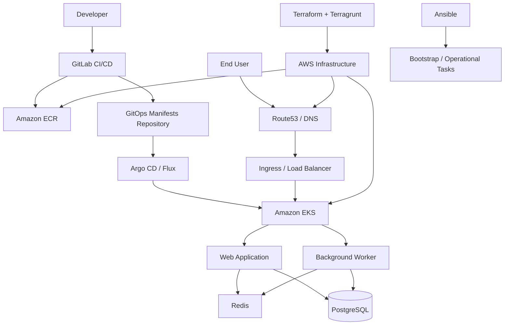

# Platform Architecture

## Purpose
This document describes the high-level architecture of the reference platform presented in this repository.

The platform is designed as a production-oriented AWS and Kubernetes-based foundation for a global SaaS workload. Its purpose is to demonstrate platform engineering thinking across infrastructure, delivery, security, reliability, and operations.

This architecture is intended to show how a modern cloud-native platform can be structured to support multiple environments, standardized delivery, and future expansion into observability, SLO-driven operations, and performance engineering.

---

## Architecture Goals
The platform is designed to achieve the following goals:

- provide a repeatable AWS foundation for multiple environments
- run containerized workloads on Kubernetes
- separate infrastructure concerns from application concerns
- support secure and standardized delivery through GitLab CI/CD
- enable GitOps-based deployment workflows
- provide a base for scaling, resilience, and future SRE practices
- support future extensions in observability, service mesh, and data/cache performance testing

---

## Core Design Principles

### 1. Cloud-first platform design
The platform is built around AWS-native infrastructure and managed Kubernetes in order to align with a realistic cloud operating model.

### 2. Repeatability through Infrastructure as Code
All infrastructure is intended to be defined and managed through Terraform and Terragrunt, with a clear separation between reusable modules and environment-specific orchestration.

### 3. Environment consistency
Development, staging, and production environments should follow the same core design, while allowing controlled differences in scale, release safety, and cost.

### 4. Secure-by-default baseline
Security must be part of the platform design from the beginning, including IAM boundaries, workload separation, secrets handling, and image validation.

### 5. Git-based operational model
Changes to infrastructure and application delivery should be traceable, reviewable, and consistent with Git-based workflows.

### 6. Platform over ad-hoc setup
This repository is intended to represent a reusable platform foundation, not a one-off deployment.

---

## High-Level Platform Components
The platform consists of the following major layers:

### AWS Foundation
Provides:
- VPC
- public and private subnets
- routing and internet access controls
- IAM roles and access boundaries
- Route53 and certificate support
- container registry support through ECR

### Kubernetes Platform
Provides:
- Amazon EKS as the managed Kubernetes control plane
- namespace-based workload separation
- ingress entry point
- scaling primitives
- workload scheduling layer
- baseline support for secure application hosting

### Infrastructure Management
Provides:
- Terraform for declarative resource provisioning
- Terragrunt for multi-environment orchestration
- modular infrastructure structure
- a foundation for consistent environment lifecycle management

### Delivery Layer
Provides:
- GitLab CI/CD for validation, build, scan, and deployment workflows
- reusable pipeline patterns
- controlled promotion across environments
- future support for deployment safety strategies

### GitOps Layer
Provides:
- version-controlled desired state for Kubernetes workloads
- reconciliation-based deployment model
- clear separation between build pipelines and cluster state application

### Security and Operations Layer
Provides:
- IAM and least privilege structure
- secrets handling direction
- policy enforcement direction
- operational runbooks and platform decision records
- a base for incident response and platform evolution

---

## Reference Workload Model
The reference platform is designed to support a small but realistic SaaS workload composed of:

- one web application
- one background worker
- PostgreSQL as the primary database
- Redis as a cache and queue support component

This workload model is intentionally simple at the product layer but rich enough to demonstrate:
- deployment workflows
- ingress and service exposure
- scaling decisions
- cache and database considerations
- background processing
- future observability and SLO instrumentation

---

## High-Level Logical Diagram

---

## Environment Model
The platform is designed with three logical environments:

### Development
Purpose:
- rapid iteration
- lower cost
- early validation of infrastructure and delivery patterns

Characteristics:
- smaller scale
- reduced resilience expectations
- faster experimental change cycle

### Staging
Purpose:
- pre-production verification
- release validation
- integration and operational checks

Characteristics:
- closer to production structure
- used for deployment and reliability validation
- controlled change process

### Production
Purpose:
- stable end-user service delivery

Characteristics:
- highest availability expectations
- strictest security controls
- most careful release process
- strongest change control and rollback requirements

---

## Network and Traffic Flow
At a high level, traffic flows through the following path:

1. users access the service through DNS
2. traffic is routed to the platform ingress entry point
3. ingress forwards requests to the relevant Kubernetes service
4. workloads communicate internally through cluster networking
5. application components connect to stateful backend services such as PostgreSQL and Redis

Detailed networking decisions are documented separately in `docs/networking.md`.

---

## Infrastructure Management Model
Infrastructure responsibilities are separated into two logical layers:

### Reusable modules
Located in:
- `terraform/modules/`

Purpose:
- define reusable building blocks
- avoid duplication
- standardize infrastructure patterns

### Environment orchestration
Located in:
- `terraform/live/`

Purpose:
- define environment-specific instantiation
- manage configuration differences across `dev`, `stage`, and `prod`
- keep environment layout explicit and reviewable

This structure is intended to support long-term maintainability and clear environment ownership.

---

## Delivery and Deployment Model
The platform delivery approach is based on two connected but separate concerns:

### CI/CD pipeline responsibilities
Handled by GitLab CI/CD:
- validate code and configuration
- run tests
- build application artifacts
- scan images and dependencies
- prepare deployment assets

### Deployment responsibilities
Handled through GitOps:
- desired workload state is stored in Git
- a reconciliation tool applies changes to the cluster
- deployment history remains traceable
- rollback and promotion become easier to reason about

This separation helps reduce deployment drift and improves operational clarity.

---

## Security Baseline
The initial platform security model assumes:

- IAM-based access separation
- principle of least privilege
- workload isolation through Kubernetes constructs
- private image registry usage
- image and dependency scanning in CI/CD
- defined direction for secrets management
- environment separation between non-production and production

Detailed security design is documented separately in `docs/security.md`.

---

## Reliability and Availability Assumptions
The platform is designed with the following high-level reliability assumptions:

- production workloads should be designed for high availability
- failure domains should be limited where possible
- application delivery should support rollback
- scaling should be intentional and measurable
- platform design should evolve toward SLO-based operations
- backup and restore strategy must be part of the platform lifecycle

Detailed scaling and resilience notes are documented in `docs/scaling.md`.

---

## Cost Awareness
This portfolio project includes cost-awareness as a platform design concern.

The architecture should explicitly consider:
- cost differences between environments
- managed service trade-offs
- scaling cost implications
- observability cost growth
- resilience versus cost trade-offs

Detailed cost notes are documented in `docs/cost.md`.

---

## Current Scope vs Future Extensions

### Included in the current architecture direction
- AWS-based platform foundation
- EKS-centered Kubernetes platform
- Terraform + Terragrunt structure
- GitLab-based CI/CD direction
- GitOps deployment model
- security baseline
- environment model
- workload model

### Planned future extensions
- observability stack integration
- SLI/SLO implementation
- incident runbooks and postmortems
- service mesh evaluation
- backup/restore validation
- performance and load testing
- golden path for development teams
- Python/Go platform tooling

---

## Known Limitations
This architecture document describes a reference platform and portfolio implementation, not a live enterprise production environment.

It demonstrates:
- architecture thinking
- platform design structure
- technical decision framing
- operational awareness

It does not claim to represent the full organizational complexity of a real multi-team SaaS company.

---

## Summary
This architecture establishes the foundation for a production-oriented AWS and Kubernetes platform designed to support standardized delivery, secure operations, and future reliability-focused evolution.

The rest of the repository expands this architecture into detailed documents, decisions, infrastructure structure, and operational practices.
